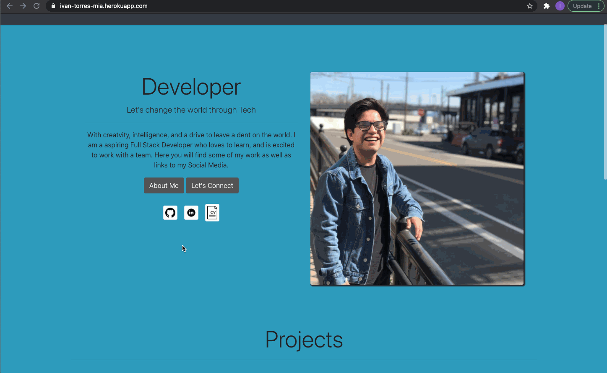

# Portfolio With React

## Table of Contents
* [Description](#Description)
* [Links](#Links)
* [Technologies](#Technologies)
* [Features](#Features)
* [Author](#Author)
* [Credits](#Credits)
* [License](#License)

## Description 
Hi! And welcome to my portfolio page! Here you will find all the information that you need to either know more about me, checkout my projects and or contact me! Thank you for checking it out! 

## Links
* [Repo](https://github.com/IvanTorresMia/Portfolio-React-itorres)
* [Deployed-Link](https://ivan-torres-mia.herokuapp.com/)

## Technologies
* [JavaScript](https://www.w3schools.com/js/)
* [AOS](https://michalsnik.github.io/aos/)
* [react](https://reactjs.org/)
* [React-Router](https://reactrouter.com/)
* [EmailJs-Com](https://dashboard.emailjs.com)
* [CSS](https://www.w3schools.com/css/)
* [HTML](https://www.w3schools.com/html/)
* [JSX](https://reactjs.org/docs/introducing-jsx.html)


## Features


## Code

* This is the code I used to map through my projects, Using Context.
```
      <div className="ConStyle">
            <div className="title">
            <h1 className="display-4">Projects</h1>
            </div>
            <hr />
            <div className="row card-group">
            {projects.map((project, i) => (
                <div className="col-sm-4 projectStyle rounded" data-aos="fade-left">
                    <h3 className="font-weight-normal">
                    {project.name}
                    </h3>
                    <a href={project.link}>
                    
                    </a>
                </div>
    ))}
            </div>
        </div>
  ```


## Author
Ivan Torres
* [GitHub-Repo]()
* [linkedIn](www.linkedin.com/in/ivan-torres-0828931b2)

## Credits
* Credits for this homework assignment go out to Jerome, Manuel, Kerwin, Roger, and all of my classmates who helped me in study sessions. As well as my tutor who helped me a ton with understanding this homework assignment. 
* [StackOverFlow](https://stackoverflow.com/)


## License]
[](https://www.mit.edu/~amini/LICENSE.md)